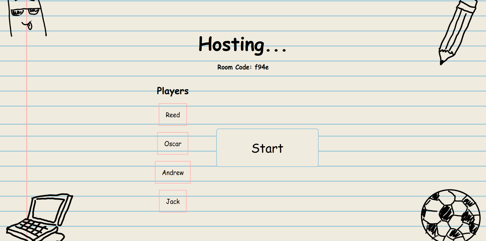
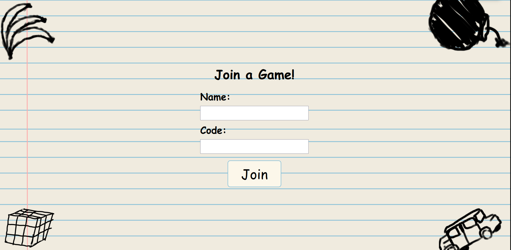
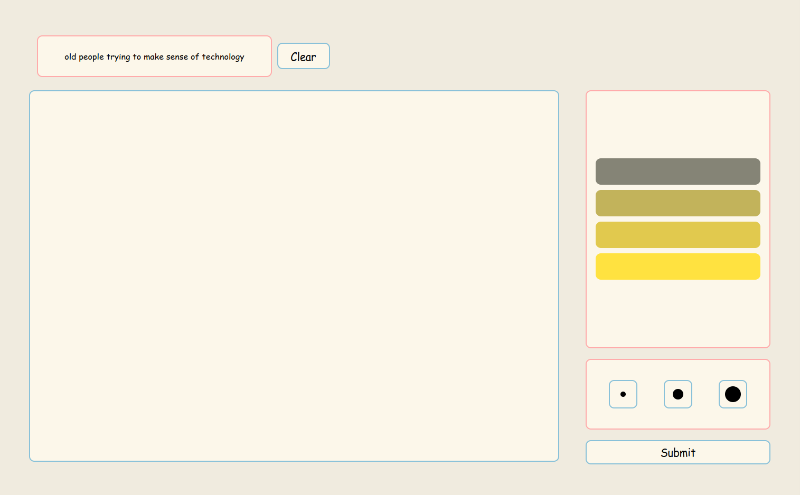
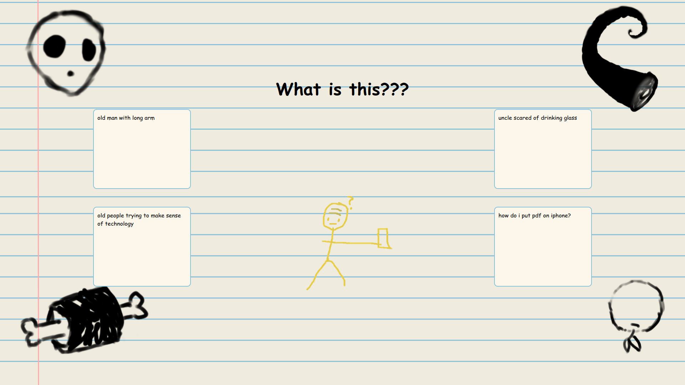
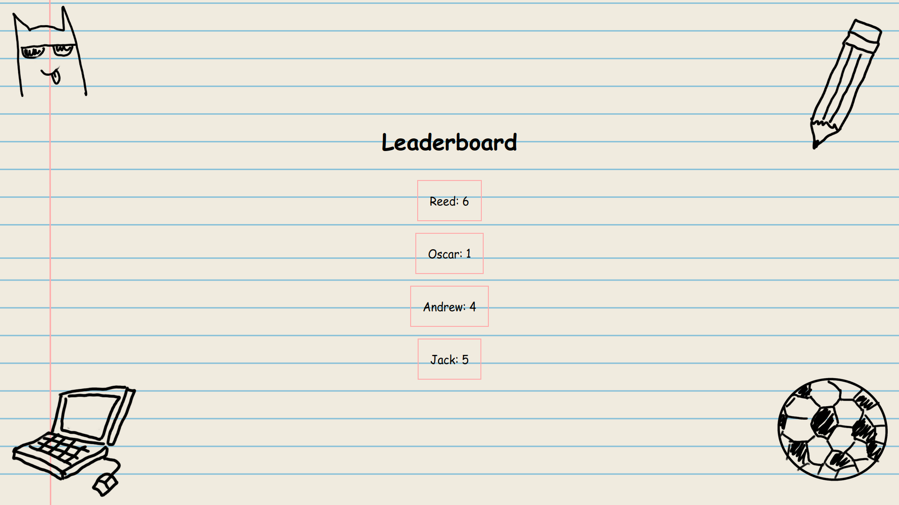

# Not-Great-Not-Drawful

A real-time drawing game where players draw prompts and others guess what they are.

## Starting the Game
Install dependencies using npm:
```bash
npm install
```

Then start the server:
```bash
node app.js
```

The game will be available at `http://localhost:8001`. Click the "Host" button to start a new lobby!



## Joining the Game
If your firewall is open, your friends can join your game by entering your IP address and the port number (8001 by default) in their browsers.

Once they click "Join", they will be prompted to enter a nickname and a room code to join your lobby.



Once everyone has joined, you're ready to start the game!

## Playing the Game

The game starts each player being given a random prompt to draw. Players have 60 seconds to draw their prompt on a canvas. Each player can choose from a limited color palette to draw with. Player cannot undo individual strokes, but they can clear the entire canvas if they want to start over.



Once the time is up, players will be shown each other's drawings one at a time and will have to guess what the prompt was. The player who drew the prompt will not be able to guess their own drawing. Players can type in their guesses and submit them.

Once all players have submitted their guesses, the game will display the drawing, the guesses, and the correct answer. Players are prompted to guess what the prompt was between the guesses. The player who drew the prompt will receive points based on how many players guessed correctly, and players who guessed correctly will also receive points. Tricksters whose guesses were voted on by other players will receive points.



The scoring works as follows:
- If a player guesses the correct answer, both themself and the artist receive 1 point.
- If a player guesses incorrectly, they receive 0 points, and the person who's prompt was guessed receives 1 point.

Once all players have had a turn drawing and guessing, the game will display the final scores and the player with the most points wins!
Have fun playing!


